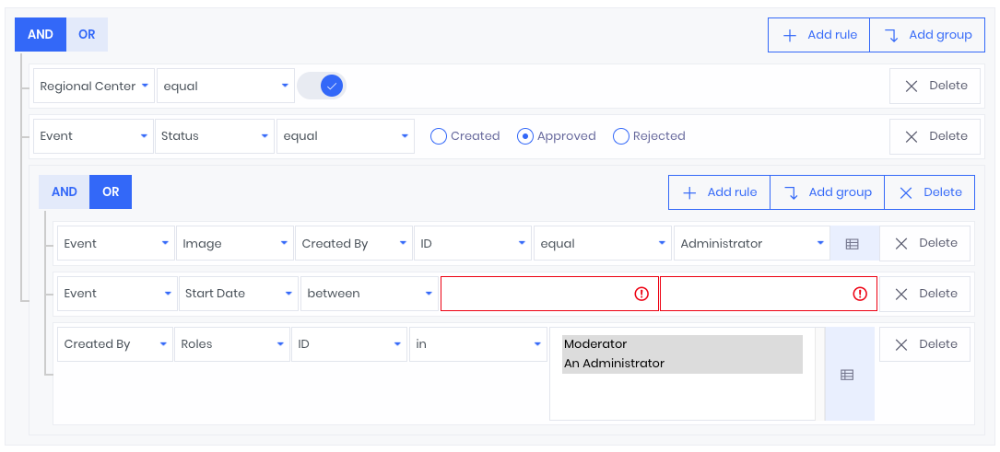

# jQuery Nested Criteria Builder

> This package adds support for creating nested criteria to [jQuery-QueryBuilder](https://github.com/mistic100/jQuery-QueryBuilder). And completely based on it.
> I tried to inherit and override some methods, but there are too many small changes in many files.
> Thanks to Damien Sorel for your powerful code.



*on screen used commercial design [Metronic](https://keenthemes.com/metronic/preview/demo12/)*

## Important note

Only works with the content type "application/x-www-form-urlencoded" and the GET method. Query parameters are encoded using $.param and decoded using $.deparam. The default decoded parameters example:

```JSON
{
	"filter": [
	    [
	        "or",
	        ["user.updatedBy.name", "like", "administrator"],
	        ["user.updatedBy.name", "notLike", "nimda"],
	        [
	            ["user.id", "isNotNull"],
	            ["user.id", "between", 1, 2]
	        ]
	    ],
	    ["user.id", "in", [ 1, 2, 3 ]]
	]
}
```

In this case, the form fields will be automatically restored. To override this behavior, edit [src/itaces/adapter.js](src/itaces/adapter.js).

### Dependencies
 * [jQuery 3](https://jquery.com)
 * [jQuery.extendext](https://github.com/mistic100/jQuery.extendext)
 * [jQuery.deparam](https://www.npmjs.com/package/jquery-deparam)
 * [Bootstrap 4](https://getbootstrap.com/)
 * [Bootstrap Datepicker](https://github.com/uxsolutions/bootstrap-datepicker)
 * [Bootstrap Datetimepicker](https://github.com/smalot/bootstrap-datetimepicker)
 * [Bootstrap Timepicker](https://github.com/jdewit/bootstrap-timepicker)
 * [doT.js](https://olado.github.io/doT)
 * [MomentJS](https://momentjs.com) (optional, for Date/Time validation)

### Prerequisites

 * NPM: [https://www.npmjs.com/get-npm](https://www.npmjs.com/get-npm)
 * Gulp CLI: `npm install --global gulp-cli`

## Install

```bash
npm install
```

## Setting up

You may wish to override [src/itaces/metadata.js](src/itaces/metadata.js) to provide the correct settings for fetching and converting metadata from your server. For embedding in your design, look and modify [src/template.js](src/template.js).

## Build

```bash
npm run dev
```

## License
This library is available under the MIT license.
